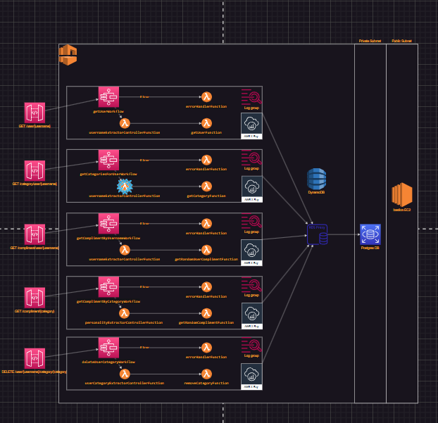

# Gratitude Serverless Back End

## Environment configuration
- Need a key pair for bastion host connection named gratitude-bastion

> Even if you don't plan to connect to this instance, it is still needed for the instance to be created.

- aws cli needs to be configured. Install aws cli and run `aws configure` to begin configuration.

> Note: You need an IAM user setup for programmatic access with admin policy attached.

- You will need to ssh into the bastion host and run an initialization script onto the db server for the database to be initialized.

 > The init sql file is located under the sql directory. copy it to the bastion host and run `psql -h <rds dns> -d postgres -U db_user -f init.sql`. You will need to input the password credentials for the rds user. These credentials are stored inside AWS Parameter Store Secrets Manager. Open this service in the aws console, copy the password, and paste the password into the console.

## Deploying
1. The lambdas are containerized. Without a CI/CD system, you'll need to package and deploy the container manually.
    - Create the ECR registry in AWS. Use the repository name: `gratitude-functions`, else you'll need to change the registry name in the `scripts/docker-push.sh` file.
    - Open the `scripts/docker-push.sh` in a text editor
    - Replace all instances of `<acc#>` with your account number
    - Save and run the script to deploy the containerized application.
2. In AWS, create a key pair for the bastion server. Name the key-pair `bastion` to match the deployment manifest.
3. Run the deployment script using npm.
    - For initial deployments, run `npm run sam:deploy:initial`. This will walk you through options for deployment and create a configuration file for later deployments.
    - For subsequent deployments, run `npm run sam:deploy` to deploy the application according sam's configuration file.
4. Run the init.sql script from the bastion server.
    - Gather the ip address of the bastion and have the ssh key ready.
    - Open the `scripts/

## Usage
You will need to be a user in the Cognito user pool to gather an authentication token to make http requests to the API Gateway.
1. Open your terminal and run `aws cognito-idp sign-up --client-id <client id> --username <username> --password <password [capital and number are required]> --user-attributes Name=email,Value=<some email>`
2. Open your terminal and run `aws cognito-idp initiate-auth --auth-flow USER_PASSWORD_AUTH --client-id <client id found in the app client page> --auth-parameters USERNAME=<username>,PASSWORD=<password> [>> token.json]`
3. Use the id token in the response in the Authorization header of your requests.

## Reference Architecture
